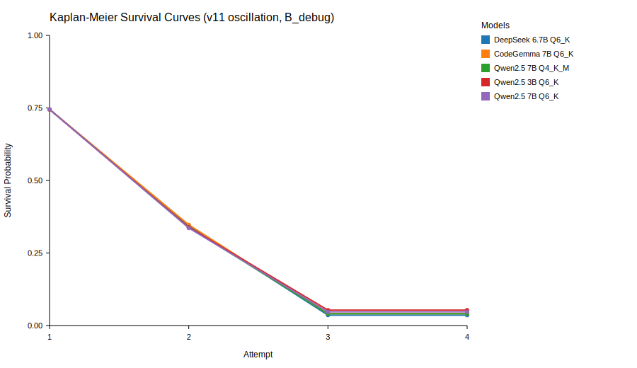

# Decision Rigidity in Local Code Models - Research Notes (v9/v11)

## Abstract
Do small-scale code models exhibit path dependence (decision rigidity) under iterative refinement? We evaluate local 3B-7B models on two synthetic suites and track approach changes across multiple fix attempts with a heuristic classifier. We find low approach switching under deterministic settings and strong sensitivity to temperature, but these findings are bounded by synthetic task design and guardrail effects.

**Research question:** Do small-scale local code models entrench on initial solution strategies when iteratively fixing code?

Results reported here were computed on Feb 4, 2026 using `runs/yyy_*`, `runs/zzz_*`, and `runs/temp2_*`.

## What This Project Does

- Measures fix success across multiple attempts on two synthetic task suites.
- Tracks approach changes between attempts using a heuristic, topic-aware classifier.
- Audits run integrity (missing tasks, fingerprints, cross-model diffs).
- Reports Kaplan-Meier survival curves to characterize entrenchment over attempts.
- Tests a limited **intervention** (strategy perturbation) on a failed subset.

## What This Project Does Not Do

- It does not establish generalization to external benchmarks (all tasks are synthetic).
- It does not provide ground-truth architectural intent for "approach" labels.
- It does not measure full model capability absent guardrails (guardrails shape outcomes).
- It does not run temperature sweeps or large statistical replications.
- It does not claim causal conclusions about "entrenchment" beyond these task suites.

## Hardware, Runtime, and Cost Transparency

- GPU: GTX 1080 Ti
- CPU: Ryzen 9 5900X
- RAM: 32GB
- Server: `llama-server` (OpenAI-compatible `/v1/chat/completions`)
- Context: 4096
- Default inference: `temperature=0.0`, `max_tokens=512`
- Attempts: `max_attempts=4`
- Per-test timeout: `timeout_s=3`

Observed wall time (this machine):
- 5-model ablation: ~3 hours
- Single model run: ~30 minutes

Electricity cost was not estimated.

Guardrails applied during evaluation:

- `no_progress`: reject a fix if `new_code.strip() == prev_code.strip()`
- `rewrite_too_large`: reject if `len(new_lines)/len(prev_lines) > 1.5` and `len(prev_lines) >= 6`
- `rewrite_max_abs_lines=0` (disabled)

These guardrails are part of the measurement, not incidental. They materially affect failure modes.

## Task Suites

### v9_fixedtiers (bugfix suite)

- 200 tasks, stdlib-only
- Tier distribution:
  - Tier 1: 20 tasks (trivial)
  - Tier 2: 50 tasks (edge cases / parsing)
  - Tier 3: 60 tasks (two-stage fixes)
  - Tier 4: 50 tasks (structural fixes)
  - Tier 5: 20 tasks (cross-cutting reasoning)

File: `data/tasks/v9_fixedtiers.jsonl`

### v11_osc_total_200 (oscillation suite)

- 200 tasks, 8 topics, 25 tasks each
- Topics: `string_match`, `interval_merge`, `sorting`, `search`, `heap`,
  `priority_queue`, `topological_sort`, `trie`
- Designed to allow multiple plausible architectural approaches

File: `data/tasks/v11_osc_total_200.jsonl`

## Experimental Design

- v9 bugfix runs: `runs/yyy_*` (5 models)
- v11 oscillation runs: `runs/zzz_*` (5 models)
- Single temperature-0.2 run: `runs/temp2_qwen2_5_coder_7b_instruct_q6_k`
- Intervention testing runs: `runs/v2_inj_*`, `runs/v3_inj_*`

Each run directory contains:

- `fact_run.jsonl` (run-level results)
- `fact_step.jsonl` (step-level traces)
- `server_models.json` (LLM server fingerprint)

## Metrics

Bugfix metrics (from `ablation_readout.py`):

- `fix_p@k`: fraction solved after k fix attempts
- `medAtt`: median fix attempts among successful runs
- `imprRate`: fraction of runs where best failure count improves vs first
- `thrash2`: fail-curve oscillation (failure count decreases then increases)

Oscillation metrics (from `oscillation_metrics.py`):

- `switch rate`: approach changes across fix attempts
- `early deviation`: first fix approach != starter approach
- `stuck`: no success and no meaningful progress
- `NoDec`: no accepted decision points (guardrail rejections)
- `ApproachOsc`: A->B->A patterns (oscillation back to a previous approach)

**Switch rate normalization:** switch rate is computed as total approach changes divided by total tasks. Tasks with fewer than two decisions cannot contribute a switch (they count as 0).

Survival / entrenchment (from `multi_model_analysis.py`):

- Kaplan-Meier hazard by attempt
- Decreasing hazard suggests entrenchment (probability of success declines)

## Classifier Validation (Sanity Check)

We do not yet have a formal manual audit. As an automatic consistency check on v11, **685/685 code-fix decisions** had detected approaches that were members of each task's declared `approaches` list. This is a sanity check, not a proof of ground-truth correctness.

## Results

### v9 bugfix suite (B_debug, 200 tasks/model)

Aggregate metrics:

| Model | fix_p@1 | fix_p@4 | medAtt | rewrite_too_large | lat_p50 (ms) |
|---|---:|---:|---:|---:|---:|
| CodeGemma 7B IT Q6_K | 81.0% | 82.0% | 1.00 | 3.5% | 3275 |
| DeepSeek Coder 6.7B Q6_K | 83.0% | 83.5% | 1.00 | 1.5% | 4400 |
| Qwen2.5 Coder 3B Q6_K | 80.5% | 82.0% | 1.00 | 3.0% | 4644 |
| Qwen2.5 Coder 7B Q4_K_M | 84.0% | 84.0% | 1.00 | 3.0% | 4207 |
| Qwen2.5 Coder 7B Q6_K | 81.5% | 84.0% | 1.00 | 1.5% | 5146 |

Tier ranges across models:

- Tier 1: fix_p@1 = 100%, fix_p@4 = 100%
- Tier 2: fix_p@1 = 84-86%, fix_p@4 = 84-86%
- Tier 3: fix_p@1 = 88.3-91.7%, fix_p@4 = 88.3-91.7%
- Tier 4: fix_p@1 = 70-78%, fix_p@4 = 72-78%
- Tier 5: fix_p@1 = 50-55%, fix_p@4 = 55-65%

Interpretation: extra attempts add only 1-3pp on aggregate; difficulty separation exists by tier, but cross-model differences are small.

### Quantization comparison (Qwen 7B Q4_K_M vs Q6_K)

| Suite | Metric | Q4_K_M | Q6_K |
|---|---|---:|---:|
| v9 bugfix | fix_p@1 | 84.0% | 81.5% |
| v9 bugfix | fix_p@4 | 84.0% | 84.0% |
| v11 oscillation | success | 83.5% | 83.5% |
| v11 oscillation | switch rate | 0.08/run | 0.09/run |

Interpretation: quantization has minimal impact on accuracy and switching in these suites.

### v11 oscillation suite (B_debug, 200 tasks/model)

Approach detection coverage: 100% on 910 decisions.

| Model | Success | Switch rate | Early dev | Stuck | NoDec |
|---|---:|---:|---:|---:|---:|
| CodeGemma 7B IT Q6_K | 83.5% | 0.09/run | 16.7% | 3.0% | 8.0% |
| DeepSeek Coder 6.7B Q6_K | 82.0% | 0.07/run | 13.3% | 2.5% | 9.5% |
| Qwen2.5 Coder 3B Q6_K | 83.0% | 0.09/run | 15.9% | 4.0% | 8.5% |
| Qwen2.5 Coder 7B Q4_K_M | 83.5% | 0.08/run | 15.0% | 3.0% | 8.5% |
| Qwen2.5 Coder 7B Q6_K | 83.5% | 0.09/run | 15.7% | 3.5% | 8.0% |

Approach oscillation (A->B->A) remained 0 across all models. Hazard rates decreased over attempts, consistent with entrenchment within this harness.

### Kaplan-Meier survival curves (v11)



### Intervention testing (strategy perturbation, failed subset)

Subset: 33 failed v11 tasks for Qwen2.5 7B Q6_K.

Prompts:

- Strategy-shift prompt after attempt 2 (guardrails relaxed)
- Conservative prompt after attempt 2 (guardrails unchanged)

Results:

- Base failures: 0% success (no_progress 17, rewrite_too_large 16)
- Strategy shift: 0% success (no_progress 33)
- Conservative: 0% success (no_progress 17, harness_missing_pytest 16)

Interpretation: intervention did not recover failures; guardrails dominate this subset.

### Sensitivity run (temperature=0.2)

Single model: Qwen2.5 7B Q6_K on v11.

- Success = 100%
- Switch rate = 16.9%
- Early deviation = 8.9%

This is a single run and should not be over-interpreted. It demonstrates that temperature shifts dynamics materially.

## Interpretation (bounded)

- The harness detects low approach switching in deterministic runs.
- Guardrails are a major source of failure modes in the hardest tasks.
- The oscillation suite does not yet induce A->B->A behavior under deterministic settings.
- Temperature affects both success and switching, but this is not yet characterized systematically.

## Limitations (explicit)

- Synthetic tasks only; no external benchmarks.
- Approach detection is heuristic, not ground truth.
- Low discriminative power in v9 (most tasks are all-pass or all-fail).
- Guardrails constrain what constitutes "progress."
- Limited replication and no temperature sweep.
- Hardware limits model size, context, and experiment scale.

These limitations are fundamental to the current results and are explicitly acknowledged here.

## Related Work (brief)

- Madaan et al., "Self-Refine: Iterative Refinement with Self-Feedback" (arXiv:2303.17651): https://arxiv.org/abs/2303.17651
- Shinn et al., "Reflexion: Language Agents with Verbal Reinforcement Learning" (arXiv:2303.11366): https://arxiv.org/abs/2303.11366
- Gou et al., "CRITIC: Large Language Models Can Self-Correct with Critique" (arXiv:2305.11738): https://arxiv.org/abs/2305.11738
- Wang et al., "Self-Consistency Improves Chain of Thought Reasoning" (arXiv:2203.11171): https://arxiv.org/abs/2203.11171

## Reproduction

### Windows (PowerShell)

```
python src/coding_eval/run_eval.py ^
  --tasks_path data/tasks/v11_osc_total_200.jsonl ^
  --model_id qwen2_5_coder_7b_instruct_q6_k ^
  --run_tag zzz_qwen2_5_coder_7b_instruct_q6_k ^
  --max_attempts 4 ^
  --timeout-s 3 ^
  --variants B_debug
```

### Unix (bash)

```
python src/coding_eval/run_eval.py \
  --tasks_path data/tasks/v11_osc_total_200.jsonl \
  --model_id qwen2_5_coder_7b_instruct_q6_k \
  --run_tag zzz_qwen2_5_coder_7b_instruct_q6_k \
  --max_attempts 4 \
  --timeout-s 3 \
  --variants B_debug
```

Ablation readout:

```
python src/coding_eval/ablation_readout.py --run_dirs runs/yyy_* --tasks_path data/tasks/v9_fixedtiers.jsonl
```

Oscillation metrics:

```
python src/coding_eval/oscillation_metrics.py --run_dirs runs/zzz_* --tasks_path data/tasks/v11_osc_total_200.jsonl
```

Multi-model analysis:

```
python src/coding_eval/multi_model_analysis.py --run_dirs runs/zzz_* --tasks_path data/tasks/v11_osc_total_200.jsonl --output data/results/multi_model_results_zzz
```

Audit runs:

```
python src/coding_eval/audit_runs.py --run_dirs runs/yyy_* --tasks_path data/tasks/v9_fixedtiers.jsonl --diff_tasks
```

## Artifacts

- v9 tasks: `data/tasks/v9_fixedtiers.jsonl`
- v11 tasks: `data/tasks/v11_osc_total_200.jsonl`
- v11 failed subset: `data/tasks/v11_osc_failed_zzz_qwen2_5_coder_7b_instruct_q6_k.jsonl`
- v9 runs: `runs/yyy_*`
- v11 runs: `runs/zzz_*`
- Temp=0.2 run: `runs/temp2_qwen2_5_coder_7b_instruct_q6_k`
- Multi-model results: `data/results/multi_model_results_zzz/`, `data/results/multi_model_results_temp2/`
- Reports: `data/results/reports/`
